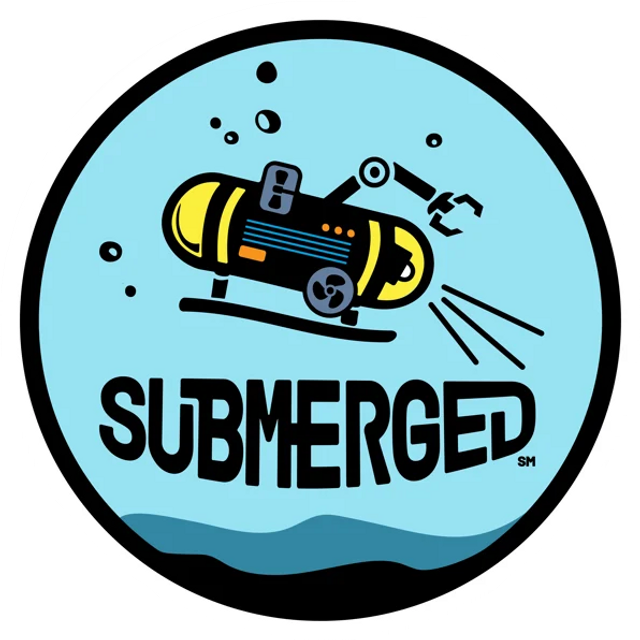

# Project Description

This repository contains the MicroPython code for our EV3 robot that we used during competition.

# Repository Organization

- _src_ : All of the source code

  - robot.py : Robot class and functions
  - main.py : Main code

    
